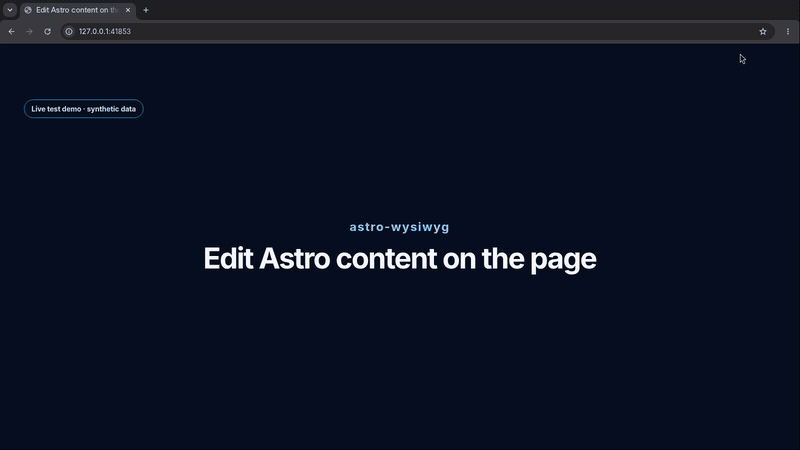

# Astro WYSIWYG

`WYSIWYG` stands for "what you see is what you get": edit content where it appears on the page instead of switching to a source file. This integration writes changes back to `.astro`, `.md`, or `.mdx` files during development, while production builds remain unchanged.

During `astro dev`, the integration maps rendered elements to their source ranges, loads an in-browser editor, and sends validated changes to a local endpoint that updates those ranges.

[](.github/assets/astro-wysiwyg-demo.mp4)

## Install

```sh
npm install --save-dev astro-wysiwyg
```

Add the integration to `astro.config.mjs`:

```js
import { defineConfig } from 'astro/config';
import wysiwyg from 'astro-wysiwyg';

export default defineConfig({
  integrations: [wysiwyg()],
});
```

## Use

Start Astro in development mode, then click supported page text to edit it. The editor provides inline formatting, links, lists, headings, block controls, undo, and save actions.

Open **Page editor** in Astro's development toolbar to enable or disable editing, autosave, editable outlines, and Markdown frontmatter editing.

Changes save after 500 ms by default. Explicit Save and Done actions remain available when autosave is disabled.

## Options

```js
wysiwyg({
  saveDelay: 800,
  endpoint: '/_astro-wysiwyg/save',
});
```

- `saveDelay`: delay before autosaving, in milliseconds. Default: `500`.
- `endpoint`: local development endpoint for source writes. Default: `/_astro-wysiwyg/save`.

## Supported content

The editor supports static paragraphs, headings, list items, common text-bearing Astro elements, and standard inline Markdown formatting. It can also add, delete, or change supported blocks.

Dynamic Astro expressions, MDX components, and Markdown constructs that cannot be written back safely are left unchanged.

## Safety

Source writes run only under `astro dev`. The endpoint accepts same-origin requests from loopback clients and confines writes to supported source files inside the configured `src` directory.

Do not expose the development editor through a LAN host, reverse proxy, or tunnel.

## Browser support

The editor supports current desktop Chromium, Firefox, and Safari.
