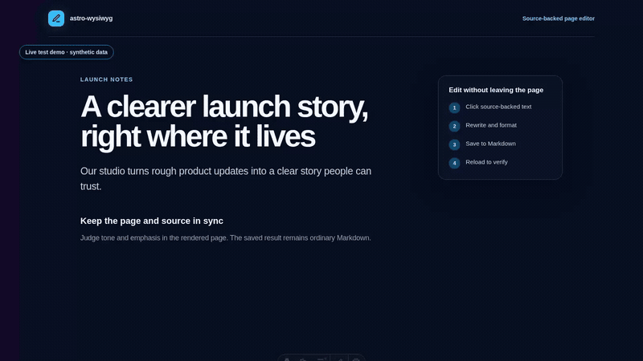

# Astro WYSIWYG

Edit rendered Astro content in place during development. The page keeps its normal CSS, while text and inline formatting are written back to the `.astro`, `.md`, or `.mdx` source file.

The integration adds no editor markup or client code to production builds.

## Walkthrough

[](artwork/demo/astro-wysiwyg-demo.mp4)

The walkthrough records a visible Chromium window running a local synthetic Astro site and the real save endpoint. It uses the native pointer to click rendered Markdown, rewrites a phrase, applies visible bold formatting, saves, reloads, and checks the updated source file. Run `npm run demo:record` to regenerate the MP4 and GIF; the command uses no model provider or external service.

## Install

```sh
npm install --save-dev astro-wysiwyg
```

Add the integration to `astro.config.mjs`:

```js
import { defineConfig } from 'astro/config';
import wysiwyg from 'astro-wysiwyg';

export default defineConfig({
  integrations: [wysiwyg()],
});
```

For a local checkout, use its path instead:

```sh
npm install --save-dev ../astro-wysiswyg
```

Start Astro with `npm run dev`, then click an editable text block.

## Controls

| Action | Control |
| --- | --- |
| Undo the last block checkpoint | `Ctrl+Z`, `Cmd+Z`, or **Undo** |
| Bold | `Ctrl+B` or `Cmd+B` |
| Italic | `Ctrl+I` or `Cmd+I` |
| Add or edit a link | `Ctrl+K`, `Cmd+K`, or **Link** |
| Numbered list | `Ctrl+Shift+7`, `Cmd+Shift+7`, or **Numbered list** |
| Bullet list | `Ctrl+Shift+8`, `Cmd+Shift+8`, or **Bullet list** |
| Heading 1-6 | `Alt+1` through `Alt+6` |
| Add a paragraph after the active block | **Add block below** |
| Remove the active block | **Delete block**, then confirm |
| Move focus to the previous or next editable block | `Alt+ArrowUp` or `Alt+ArrowDown` |
| Move focus to the toolbar | `Alt+F10` |
| Save now | `Ctrl+S`, `Cmd+S`, or **Save** |
| Finish editing | `Escape` or **Done** |

The editor adds one roving Tab stop for source-backed blocks, even on long pages. Use `Alt+ArrowUp` or `Alt+ArrowDown` to move that stop; Tab then leaves the editable block region. Author-provided tab order remains unchanged.

The floating toolbar has Undo, Bold, Italic, Link, Bullet list, Numbered list, Add block below, Delete block, H1-H6, Paragraph, Save, and Done buttons. Select text before adding a link, or place the caret inside an existing link to edit or remove it. List controls convert the current block and can switch an existing list between bullet and numbered forms. Changes save after 500 ms by default. Inline and structural saves do not trigger Astro HMR page reloads, so surrounding form controls keep their current state. If Astro reloads after an external source change, the same block and caret return to edit mode automatically. Unsaved drafts are compared with the source snapshot they started from; if the source changed, the draft stays active but automatic saving pauses for review.

## Dev toolbar controls

Open **Page editor** (the pencil icon) in Astro's dev toolbar to control the editor:

- **Enable editing** turns all click-to-edit behavior on or off.
- **Autosave changes** saves after typing stops. Save, Done, and `Ctrl+S` still work when it is off.
- **Show editable outlines** controls the hover and keyboard-focus hints.
- **Edit frontmatter** opens a separate document panel without requiring a selected text block. It supports simple one-line strings, dates, numbers, booleans, and comma-separated lists backed by arrays of non-empty strings that do not contain commas. Other arrays are left unchanged and do not appear in the panel. Unsaved field changes are kept for the browser session and reopen on the same route after navigation or reload; Save, Cancel, and Escape clear the draft. A save stops if an edited field changed on disk after the panel opened; changes to other fields can still merge.

Settings are stored in the browser for the current local site.

## Options

```js
wysiwyg({
  saveDelay: 800,
  endpoint: '/_astro-wysiwyg/save',
})
```

- `saveDelay`: milliseconds to wait after input before saving. Default: `500`.
- `endpoint`: local dev-server path used for source writes. Default: `/_astro-wysiwyg/save`.

## Editable source

The integration edits source blocks it can map without guessing:

- Static paragraphs, headings, list items, and common text-bearing elements in `.astro` files.
- Paragraphs, headings, and list items in Markdown and MDX.
- Inline bold, italic, links, code, and other standard formatting inside those blocks.
- Explicit paragraph insertion after an active Astro or Markdown block, and deletion of the active block.

Astro attributes and classes stay on the original element. Markdown formatting is converted back from the browser DOM to Markdown syntax. Rendered `data.title`, `data.description`, and `frontmatter.title` text maps back to Markdown frontmatter. Article cards use their `/collection/slug` link to find the matching `src/content/collection/slug` source file.

Pasted HTML is limited to passive text formatting. Scripts, event-handler and style attributes, unsupported elements, and unsafe URL schemes are removed before source is written.

Other dynamic Astro expressions are not editable. MDX blocks containing components are also skipped. Markdown blocks with footnotes, reference-style links, or inline elements without a Turndown serialization rule are skipped rather than rewritten. Their rendered text may come from code, a CMS, or another file, or use source syntax that cannot be recovered from rendered HTML. Expression delimiters entered as visible Astro or MDX text are escaped and remain literal text.

## Browser support

Editing is supported in the desktop Chromium, Firefox, and WebKit browser engines bundled with the locked Playwright version. CI runs the complete browser suite on Chromium and the same browser-sensitive smoke workflows on Firefox and WebKit. The smoke coverage includes `contenteditable` typing, Selection and Range handling, bold and link commands, the frontmatter dialog, endpoint saves, and source persistence. Playwright WebKit is the Safari-engine proxy; CI does not run branded Safari.

## Development safety

Source writes run only under `astro dev`. The endpoint accepts same-origin JSON requests from loopback clients, confines writes to Astro's configured source directory (`srcDir`, `src/` by default) after resolving symlinks, allows only Astro and Markdown source extensions, and rejects stale or ambiguous source ranges. Dependency and generated trees outside `srcDir`, including `node_modules`, are not writable.

The integration does not authenticate remote users. Do not expose the editor through a LAN host, reverse proxy, or tunnel; a proxy running on the local machine can make a remote request appear to come from loopback.

Run the fast Node tests and TypeScript build with:

```sh
npm run check:unit
```

Run the full gate with:

```sh
npx playwright install chromium firefox webkit
npm run check
```

The full gate runs the unit, integration, and Playwright suites. It merges server and browser coverage, then requires 100% statements, branches, functions, and lines for every included file. The HTML report is written to `.coverage/report/index.html`.
